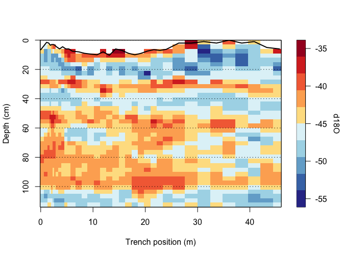
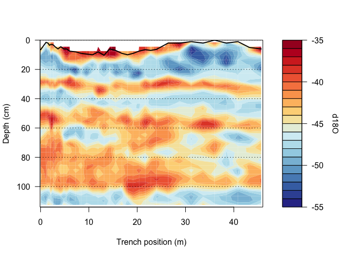

<!-- README.md is generated from README.Rmd. Please edit that file -->

# TrenchR: Analyse Trench-like Proxy Records

<!-- badges: start -->
<!-- badges: end -->

## Introduction

A *trench* denotes a spatial array of profiles that tabulate climate
proxy data over depth or time, with the profiles being sampled
longitudinally at regular or irregular intervals. The R package
**TrenchR** implements routines that are targeted at the analysis and
the plotting of the spatial (longitudinal) and vertical (temporal)
variations of the climate proxy data derived from such trenches. The
range of functions in **TrenchR** were the basis for the publications of
Münch et al. [2016](https://doi.org/10.5194/cp-12-1565-2016) and Münch
et al. [2017](https://doi.org/10.5194/tc-11-2175-2017), which analysed
Antarctic snow trench stable isotope data.

The R code in this package has been implemented by Dr. Thomas Münch. For
further information, code enhancements or potential bugs, please write
to \<<thomas.muench@awi.de>\> at the Alfred Wegener Institute, Helmholtz
Centre for Polar and Marine Research, Germany, or open an issue on the
repository page.

This work was supported by Helmholtz funding through the Polar Regions
and Coasts in the Changing Earth System (PACES) programme of the Alfred
Wegener Institute and by the Initiative and Networking Fund of the
Helmholtz Association Grant VG-NH900.

## Installation

The latest version of **TrenchR** is currently available from the
development branch of its [GitHub
repository](https://github.com/EarthSystemDiagnostics/TrenchR), and is
installed via:

``` r
# install.packages("remotes")
remotes::install_github("EarthSystemDiagnostics/TrenchR", ref = "dev")
```

## Generic **TrenchR** dataset structure

In order to optimally work with **TrenchR** and facilitate the
application of **TrenchR** functions, it is convenient to prepare your
“trench” dataset in a way that adheres to the **TrenchR** generic
dataset structure. In the following, this generic structure is
introduced and it is shown in a small example how to shape your own data
into this structure.

### The structure

**TrenchR** comes with four trench datasets: `t13.trench1`,
`t13.trench2`, `t15.trench1`, and `t15.trench2` (Münch et
al. [2016](https://doi.org/10.5194/cp-12-1565-2016),
[2017](https://doi.org/10.5194/tc-11-2175-2017)). Since `t13.trench2` is
the smallest of these four, it is easiest to have a look at this dataset
to understand the generic structure:

``` r
t13.trench2
#> # A tibble: 152 × 8
#>    profileName profilePosition surfaceHeight sampleNumber depth  d18O    dD
#>    <chr>                 <dbl>         <dbl>        <int> <dbl> <dbl> <dbl>
#>  1 T13-2-01                0.3             4            1   1.5  NA     NA 
#>  2 T13-2-01                0.3             4            2   4.5 -40.4 -327.
#>  3 T13-2-01                0.3             4            3   7.5 -43.6 -346.
#>  4 T13-2-01                0.3             4            4  10.5 -43.7 -346 
#>  5 T13-2-01                0.3             4            5  13.5 -43.3 -342.
#>  6 T13-2-01                0.3             4            6  16.5 -47.0 -370.
#>  7 T13-2-01                0.3             4            7  19.5 -49.7 -389.
#>  8 T13-2-01                0.3             4            8  22.5 -46.8 -363.
#>  9 T13-2-01                0.3             4            9  25.5 -46.0 -358.
#> 10 T13-2-01                0.3             4           10  28.5 -40.3 -313.
#> # ℹ 142 more rows
#> # ℹ 1 more variable: dxs <dbl>
```

You can see that the generic dataset structure is nothing more than a
`tibble` (it can also be a simple `data.frame`), however, with the
individual proxy profiles bound consecutively by row and with a fixed
nomenclature applied to the column names.

The minimum requirement is a tibble with columns `profileName` and
`sampleNumber` plus some actual data column. Here, the column
`profileName` indicates the position of the profile within the trench
via its name, while the column `sampleNumber` labels the individual
proxy data samples within a profile:

``` r
nrow(t13.trench2)
#> [1] 152

unique(t13.trench2$profileName)
#> [1] "T13-2-01" "T13-2-02" "T13-2-03" "T13-2-04"
unique(t13.trench2$sampleNumber)
#>  [1]  1  2  3  4  5  6  7  8  9 10 11 12 13 14 15 16 17 18 19 20 21 22 23 24 25
#> [26] 26 27 28 29 30 31 32 33 34 35 36 37 38
```

thus, the trench `t13.trench2` contains four profiles labelled
“T13-2-01”, “T13-2-02”, “T13-2-03”, and “T13-2-04”, and each profile
includes 38 proxy samples.

In addition, you can provide information on the horizontal profile
positions within the trench in a column named `profilePosition`, and, if
applicable, on the top heights of the profiles relative to some
horizontal reference in the column `surfaceHeight`. While these
additional two columns are not mandatory in general, they are required
for some **TrenchR** functions.

Usually, there is also some vertical scale associated with the samples
and sample numbers. This can be “depth”, as for `t13.trench2`, or
“time”, or any other applicable scaling. **TrenchR** functions, which
need to use this vertical scale in order to work, include the function
parameter `vscale` to specify the name of the vertical scale column. In
this context it is also important to note that for **TrenchR** we
**inherently assume** that this vertical scale is *absolute*, i.e. that
it is the same for all profiles.

### Creating a trench dataset

Suppose you have sampled a trench with three profiles, where each
profile includes two samples. Then, one easy way to shape these data
into the generic structure is to create a data frame for each profile
and then bind these data frames together by row.

Step by step this means:

``` r
# create a data frame for each profile
prf1 <- tibble::tibble(
  sampleNumber = 1 : 2, depth = c(2, 4), my_data = c(1.1, 2.1))
prf2 <- tibble::tibble(
  sampleNumber = 1 : 2, depth = c(2, 4), my_data = c(2.2, 1.2))
prf3 <- tibble::tibble(
  sampleNumber = 1 : 2, depth = c(2, 4), my_data = c(0.3, 4.3))

# bind them together
my_trench <- dplyr::bind_rows(profile1 = prf1, profile2 = prf2, profile3 = prf3,
                              .id = "profileName")

my_trench
#> # A tibble: 6 × 4
#>   profileName sampleNumber depth my_data
#>   <chr>              <int> <dbl>   <dbl>
#> 1 profile1               1     2     1.1
#> 2 profile1               2     4     2.1
#> 3 profile2               1     2     2.2
#> 4 profile2               2     4     1.2
#> 5 profile3               1     2     0.3
#> 6 profile3               2     4     4.3
```

Since profile positions and/or surface heights are a single value for
each profile, you can directly provide these information in the first
step:

``` r
prf1 <- dplyr::mutate(prf1, profilePosition = 0, surfaceHeight = 2)
prf2 <- dplyr::mutate(prf2, profilePosition = 5, surfaceHeight = 0)
prf3 <- dplyr::mutate(prf3, profilePosition = 13, surfaceHeight = 1)

my_trench <- dplyr::bind_rows(profile1 = prf1, profile2 = prf2, profile3 = prf3,
                              .id = "profileName")

my_trench
#> # A tibble: 6 × 6
#>   profileName sampleNumber depth my_data profilePosition surfaceHeight
#>   <chr>              <int> <dbl>   <dbl>           <dbl>         <dbl>
#> 1 profile1               1     2     1.1               0             2
#> 2 profile1               2     4     2.1               0             2
#> 3 profile2               1     2     2.2               5             0
#> 4 profile2               2     4     1.2               5             0
#> 5 profile3               1     2     0.3              13             1
#> 6 profile3               2     4     4.3              13             1
```

And now you are already good to go to apply all the nice **TrenchR**
functions to your trench dataset!

## Applying **TrenchR**

### Extracting trench information

For quick access, **TrenchR** provides functions to directly retrieve
information on the trench dataset, such as the horizontal profile
positions,

``` r
getX(t13.trench2)
#> [1]  0.3 10.0 29.8 40.0
```

the vertical scale,

``` r
getZ(t13.trench2) # default is the same as getZ(t13.trench2, vscale = "depth")
#>  [1]   1.5   4.5   7.5  10.5  13.5  16.5  19.5  22.5  25.5  28.5  31.5  34.5
#> [13]  37.5  40.5  43.5  46.5  49.5  52.5  55.5  58.5  61.5  64.5  67.5  70.5
#> [25]  73.5  76.5  79.5  82.5  85.5  88.5  91.5  94.5  97.5 100.5 103.5 106.5
#> [37] 109.5 112.5
```

and the trench surface profile:

``` r
getSurfaceProfile(t13.trench2)
#> # A tibble: 4 × 2
#>   position height
#>      <dbl>  <dbl>
#> 1      0.3    4  
#> 2     10      9.5
#> 3     29.8    4.5
#> 4     40      0.5
```

For such undulating trench surfaces, `getFirstCompleteDepthBin` extracts
the value of the first bin of the vertical scale dimension
(e.g. “depth”) for which a complete dataset across all trench profiles
is available:

``` r
getFirstCompleteDepthBin(t13.trench2)
#> [1] 10.5
getFirstCompleteDepthBin(t15.trench1)
#> [1] 19.5
```

If you already might have an estimate of the horizontal autocorrelation
($a_1$) of your trench data at hand, you can use `getEffectiveTrenchDOF`
to calculate the effective horizontal degrees of freedom of your trench
dataset:

``` r
getEffectiveTrenchDOF(a1 = 0.5, N = 10, delta = 2)
#> [1] 6.338028
# is equivalent to:
getEffectiveTrenchDOF(a1 = 0.5, positions = seq(0, 18, 2))
#> [1] 6.338028
```

### Two-dimensional dataset

The inherent two-dimensional structure of a trench dataset can be
directly visualised in matrix form; while this matrix representation is
currently not needed for using any of the below **TrenchR** functions,
since they all accept the generic dataset structure as input, it might
be handy for external functions and usage.

``` r
make2D(t13.trench2)
#> # A tibble: 38 × 4
#>    `T13-2-01` `T13-2-02` `T13-2-03` `T13-2-04`
#>         <dbl>      <dbl>      <dbl>      <dbl>
#>  1       NA         NA         NA        -39.4
#>  2      -40.4       NA        -40.0      -44.6
#>  3      -43.6       NA        -43.2      -47.1
#>  4      -43.7      -37.8      -45.9      -48.0
#>  5      -43.3      -42.3      -47.7      -47.0
#>  6      -47.0      -47.0      -48.0      -46.3
#>  7      -49.7      -49.3      -47.3      -42.2
#>  8      -46.8      -47.4      -47.6      -39.8
#>  9      -46.0      -40.5      -46.4      -39.2
#> 10      -40.3      -39.0      -42.7      -39.5
#> # ℹ 28 more rows

# Note: use simplify = TRUE to really have the output class `matrix`
```

The default is to extract the data column labelled `d18O`; to extract
any other data column, use

``` r
make2D(t13.trench2, .var = "dxs") # insert your data column name for `.var`
#> # A tibble: 38 × 4
#>    `T13-2-01` `T13-2-02` `T13-2-03` `T13-2-04`
#>         <dbl>      <dbl>      <dbl>      <dbl>
#>  1       NA         NA         NA         -4.6
#>  2       -4.5       NA         -3          2.1
#>  3        2.6       NA          2.1        6.3
#>  4        3.8       -2.7        4.2        5.9
#>  5        4.3        1          5.8        7.9
#>  6        6.2        7          7         10.1
#>  7        8.8        8.4        9          7  
#>  8       11.3        6.1       11.4        2  
#>  9       10.5        5.9       11.4        1  
#> 10        8.8        5.1        5.9        3.5
#> # ℹ 28 more rows
```

### Trench mean

The mean profile from averaging in horizontal direction across all
available profiles can be obtained directly from

``` r
makeMean(t13.trench2)
#> # A tibble: 38 × 2
#>    depth  d18O
#>    <dbl> <dbl>
#>  1   1.5  NA  
#>  2   4.5  NA  
#>  3   7.5  NA  
#>  4  10.5 -43.9
#>  5  13.5 -45.1
#>  6  16.5 -47.1
#>  7  19.5 -47.2
#>  8  22.5 -45.4
#>  9  25.5 -43.1
#> 10  28.5 -40.4
#> # ℹ 28 more rows
```

As you can see, the default method is to output the mean profile as a
data frame including the vertical scale column (here, “depth”); adjust
the `vscale` argument if your dataset uses another name for the vertical
scale column.

You can also output the mean profile as a normal vector:

``` r
makeMean(t13.trench2, df = FALSE)
#>  [1]       NA       NA       NA -43.8550 -45.0925 -47.0900 -47.1500 -45.3975
#>  [9] -43.0550 -40.3525 -42.6200 -45.3600 -46.8925 -46.9825 -45.5025 -43.4175
#> [17] -41.2925 -41.7475 -44.7850 -46.2500 -45.3775 -42.7850 -42.2175 -43.4375
#> [25] -44.5625 -44.6175 -43.9450 -42.8725 -42.5250 -42.1675 -41.7875 -41.7550
#> [33] -42.7625 -44.9100 -45.8475 -45.7000 -44.8400 -43.0675
```

Analogously to R’s `mean` function, you can control the handling of
missing values,

``` r
makeMean(t13.trench2, df = FALSE, na.rm = TRUE)
#>  [1] -39.37000 -41.67333 -44.61000 -43.85500 -45.09250 -47.09000 -47.15000
#>  [8] -45.39750 -43.05500 -40.35250 -42.62000 -45.36000 -46.89250 -46.98250
#> [15] -45.50250 -43.41750 -41.29250 -41.74750 -44.78500 -46.25000 -45.37750
#> [22] -42.78500 -42.21750 -43.43750 -44.56250 -44.61750 -43.94500 -42.87250
#> [29] -42.52500 -42.16750 -41.78750 -41.75500 -42.76250 -44.91000 -45.84750
#> [36] -45.70000 -44.84000 -43.06750
```

and similarly to `make2D`, the function parameter `.var` controls for
which data variable the mean profile is calculated.

### Plotting a two-dimensional visualisation

The two-dimensional proxy data variations can be directly visualised
using the function `plot2D`, either as a filled image plot,

``` r
plot2D(t13.trench1, xlim = c(-0.1, 46), ylim = c(114, 0), zlim = c(-55, -35),
       ylab = "Depth (cm)", hadj = 0.2, line.v = 3)
```



or as a filled contour plot:

``` r
plot2D(t13.trench1, xlim = c(-0.1, 46), ylim = c(114, 0), zlim = c(-55, -35),
       ylab = "Depth (cm)", hadj = 0.02, line.v = 3,
       filledContour = TRUE, fill = TRUE)
```



There are a couple more options to adjust and tweak the plot appearance,
so have a look at the function documentation, `?plot2D`.

### Trench variance

The variance of the horizontal and vertical data variations can be
assessed with

``` r
estimateTrenchVariance(t13.trench2, .var = "d18O")
#> # A tibble: 2 × 4
#>   direction    var lower upper
#>   <chr>      <dbl> <dbl> <dbl>
#> 1 horizontal  5.27  4.75  5.93
#> 2 vertical    7.27  6.55  8.18
```

including confidence intervals based on the Chi-Squared distribution and
the number of effective degrees of freedom (DOF) in both trench
directions. Default for the latter are the number of data points in the
trench directions; to account for autocorrelation of the data the DOF
can be supplied also manually (see also `getEffectiveTrenchDOF` above).

### Estimating trench correlations and signal-to-noise ratios

An interesting application for a trench dataset is to study how the
correlation between neighbouring profiles varies with their separation
distance. In **TrenchR**, you can assess this question using
`estimateInterProfileCorrelation`, which calculates the average pairwise
correlation between trench profiles for given separation distances
(including some tolerance so that the inter-profile distances do not all
need to exactly match the asked distances):

``` r
estimateInterProfileCorrelation(t13.trench2, distances = c(10, 30))
#> # A tibble: 2 × 5
#>   distances     N   cor    sd    se
#>       <dbl> <int> <dbl> <dbl> <dbl>
#> 1        10     2 0.373 0.269 0.190
#> 2        30     2 0.347 0.435 0.308
```

As you can see, the output gives the average correlation for each
distance and the associated standard deviation and standard error of the
mean estimate. See `?estimateInterProfileCorrelation` for details and
more information on the error estimation.

You can also calculate the correlation between profiles from two
separate trenches (assuming the two trenches were sampled at the same
time):

``` r
raw <- estimateInterTrenchCorrelation(t13.trench1, t13.trench2)
opt <- estimateInterTrenchCorrelation(t13.trench1, t13.trench2,
                                      optimize = TRUE, lag = -4 : 4)

str(raw)
#>  num [1:38, 1:4] 0.565 0.463 0.406 0.497 0.457 ...
#>  - attr(*, "dimnames")=List of 2
#>   ..$ : chr [1:38] "T13-1-01" "T13-1-02" "T13-1-03" "T13-1-04" ...
#>   ..$ : chr [1:4] "T13-2-01" "T13-2-02" "T13-2-03" "T13-2-04"
str(opt)
#> List of 2
#>  $ cor: num [1:38, 1:4] 0.565 0.463 0.436 0.497 0.457 ...
#>   ..- attr(*, "dimnames")=List of 2
#>   .. ..$ : chr [1:38] "T13-1-01" "T13-1-02" "T13-1-03" "T13-1-04" ...
#>   .. ..$ : chr [1:4] "T13-2-01" "T13-2-02" "T13-2-03" "T13-2-04"
#>  $ i  : int [1:38, 1:4] 0 0 -1 0 0 0 0 0 0 0 ...
#>   ..- attr(*, "dimnames")=List of 2
#>   .. ..$ : chr [1:38] "T13-1-01" "T13-1-02" "T13-1-03" "T13-1-04" ...
#>   .. ..$ : chr [1:4] "T13-2-01" "T13-2-02" "T13-2-03" "T13-2-04"

mean(raw)
#> [1] 0.3316521
mean(opt$cor)
#> [1] 0.4960954
```

The first result is simply a matrix of the correlations for all possible
pairs of profiles between the two trenches. In the second example, some
vertical shifts of $\pm 4$ (depth) bins are allowed via the `lag`
parameter in order to optimise (i.e. maximise) the correlations; the
result in this case is a list of two matrices where the first matrix
includes the optimised correlations between the profiles and the second
matrix the lags for which the optimal correlations were observed.

Finally, you can estimate the signal-to-noise ratio of your trench
dataset:

``` r
estimateSNR(t13.trench2, distances = c(10, 30))
#> # A tibble: 1 × 2
#>     snr    se
#>   <dbl> <dbl>
#> 1 0.562 0.441
```

which is internally based on `estimateInterProfileCorrelation` and
calculates the signal-to-noise ratio (SNR) from the mean across the
average pairwise profile correlations evaluated at the given profile
separation distances via
$\mathrm{SNR} = \overline{c}\,/\,(1 - \overline{c})$, where
$\overline{c}$ is the mean correlation.

## References

Münch, T., Kipfstuhl, S., Freitag, J., Meyer, H., and Laepple, T.:
Regional climate signal vs. local noise: a two-dimensional view of water
isotopes in Antarctic firn at Kohnen Station, Dronning Maud Land, Clim.
Past, 12(7), 1565-1581, doi:
[10.5194/cp-12-1565-2016](https://doi.org/10.5194/cp-12-1565-2016),
2016.

Münch, T., Kipfstuhl, S., Freitag, J., Meyer, H., and Laepple, T.:
Constraints on post-depositional isotope modifications in East Antarctic
firn from analysing temporal changes of isotope profiles, The
Cryosphere, 11(5), 2175-2188, doi:
[10.5194/tc-11-2175-2017](https://doi.org/10.5194/tc-11-2175-2017),
2017.
